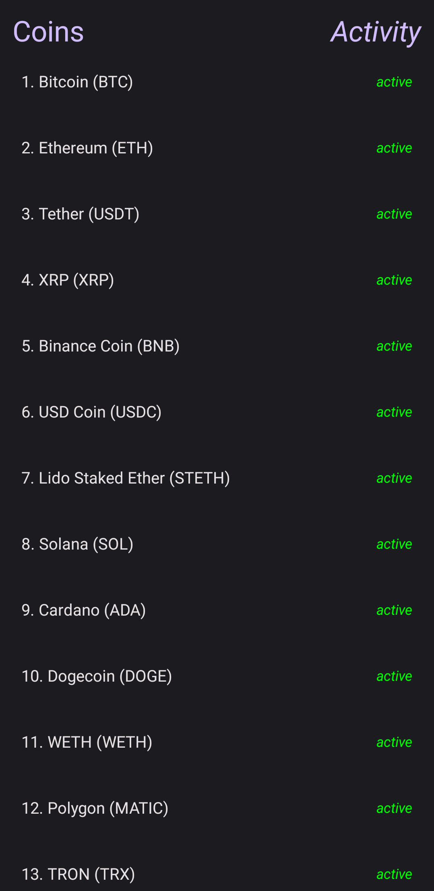
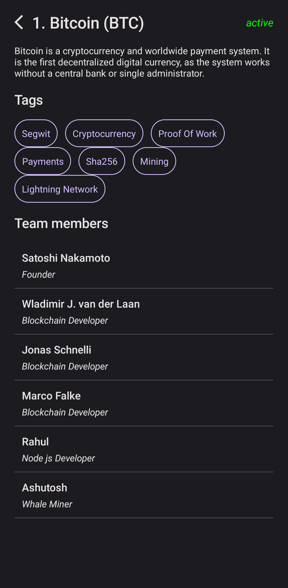

# Crypto Currency Market App

Crypto Currency Market Application which helps users to interact with several coins. You can click and see team members and tags about this coin. I use here Paprika API for fetching and using the all data. This app are written with Clean Architecture principles. Using technologies are:
* Clean Architecture
* MVVM
* Dagger-Hilt
* Paprika API
* Jetpack Compose
* Coroutines

 

## Screenshots samples from the app

 

